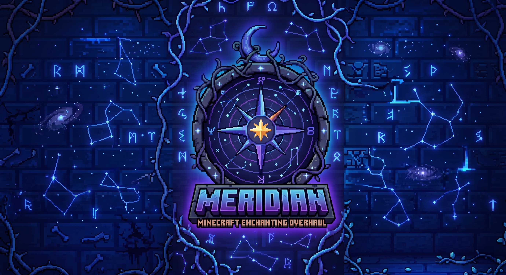

<p align="center">
  
</p>

<p align="center"><strong>Chart your enchantments.</strong></p>

<p align="center">
  <a href="https://www.minecraft.net/"></a>
  <a href="https://fabricmc.net/"></a>
  <a href="LICENSE"></a>
  <a href="https://github.com/rfizzle/meridian/releases"></a>
  <a href="https://github.com/rfizzle/meridian/actions/workflows/ci.yml"></a>
  <a href="https://www.curseforge.com/minecraft/mc-mods/meridian-enchanting-overhaul"></a>
</p>

A complete enchanting overhaul for Minecraft 1.21.1 (Fabric). Meridian replaces the vanilla enchanting table with a stat-driven system featuring five independent stats, 25+ themed shelf blocks, a two-tier enchantment library, salvage tomes, anvil upgrades, and 135 original enchantments — built on vanilla's data-driven `EnchantmentEffectComponents` with custom Java handlers where needed.

## Download

| [CurseForge](https://www.curseforge.com/minecraft/mc-mods/meridian-enchanting-overhaul) | [GitHub Releases](https://github.com/rfizzle/meridian/releases) | [Website](https://meridian.rfizzle.com) | [Report an issue](https://github.com/rfizzle/meridian/issues) |
| --- | --- | --- | --- |

---

## Features

### Stat-Driven Enchanting Table

The vanilla enchanting table's single "power" value is replaced by five independent stats, each influencing a different aspect of the enchanting process:

| Stat | Effect |
|------|--------|
| **Eterna** | Drives the maximum enchanting level — two levels per Eterna point, so the 0–50 Eterna range scales enchanting levels up to 100 (vanilla caps at 30) |
| **Quanta** | Upper bound of the random power roll — higher means more variance |
| **Arcana** | Biases selection toward rarer, more obscure enchantments |
| **Rectification** | Reduces Quanta's negative variance for more consistent results |
| **Clues** | Reveals additional enchantments in the preview tooltip |

Stats are contributed by nearby shelf blocks and are fully data-driven — server operators can retune every block's contribution via datapack JSON without touching the jar.

### Shelf Blocks

25 themed shelves organized into progression tiers:

- **Starter** — Vanilla Bookshelves, Stoneshelf, Beeshelf, Melonshelf, Dormant Deepshelf
- **Early** — Hellshelf, Seashelf (Nether and Ocean materials)
- **Mid** — Infused and upgraded variants (Infused Hellshelf, Glowing Hellshelf, Blazing Hellshelf, Infused Seashelf, Crystal Seashelf, Heart Seashelf)
- **Late** — Deepshelf, Echoing Deepshelf, Soul-Touched Deepshelf, Echoing Sculkshelf, Soul-Touched Sculkshelf
- **End** — Endshelf, Pearl Endshelf, Draconic Endshelf (the only way to reach Eterna 50)
- **Utility** — Sightshelf (bonus Clues), Rectifier (bonus Rectification), Filtering Shelf (blacklist specific enchantments), Deepshelf of Arcane Treasures (unlocks treasure enchantments like Mending)

Higher-tier shelves are crafted at the enchanting table itself using stat-gated recipes — building your shelf collection *is* the progression.

### Enchantment-Table Crafting

The enchanting table doubles as a stat-gated crafting station. When the table's stats meet a recipe's thresholds, the third enchant slot is replaced with the crafting result — click it to spend XP and craft the item. Recipes include:

- Tier-2 and tier-3 shelf upgrades
- Infused Breath (from Dragon's Breath — key material for end-tier shelves)
- Tome upgrades (Scrap → Improved Scrap → Extraction)
- Basic Library → Library of Alexandria upgrade
- Budding Amethyst, Experience Bottles, Echo Shards, and more

### Enchantment Library

A two-tier storage block that pools enchanted books into a per-enchantment point bank, then dispenses them deterministically for XP:

- **Basic Library** — stores enchantments up to level 16
- **Library of Alexandria** — stores enchantments up to level 31 (upgrade preserves stored books)

Points follow an exponential curve: `2^(level - 1)` per book deposited. The library tracks both accumulated points *and* the highest level ever deposited per enchantment — you can't grind thousands of Sharpness I books to pull a Sharpness V without first depositing at least one Sharpness V book.

Supports hopper automation for bulk book deposits. Extraction is menu-only.

### Salvage Tomes

Three tomes for moving enchantments between items, each with a different cost/reward tradeoff:

| Tome | Enchantments Recovered | Source Item | XP Cost |
|------|----------------------|-------------|---------|
| **Scrap Tome** | One (random) | Destroyed | 3 levels |
| **Improved Scrap Tome** | All | Destroyed | 5 levels |
| **Extraction Tome** | All | Preserved (takes durability damage) | 10 levels |

Tomes are used in the anvil: place the enchanted item on the left, the tome on the right.

### XP Tomes

A ladder of consumables that bank experience levels for later. Right-click to deposit one level into the tome; shift-right-click to withdraw one back to yourself. A lime durability bar shows how full the tome is. Craft each tier at the enchanting table from a Dormant XP Tome — higher tiers need a higher Eterna shelf and hold more:

| Tome | Capacity |
|------|----------|
| **XP Tome I** | 10 levels |
| **XP Tome II** | 30 levels |
| **XP Tome III** | 50 levels |

The Dormant XP Tome itself stores nothing — it's the crafting base for the active tiers.

### Anvil Upgrades

- **Prismatic Web** — Strips all curses from an item (30 levels, 1 web consumed). Non-curse enchantments are preserved.
- **Iron Block Repair** — Repairs a Damaged or Chipped Anvil by one tier (1 iron block consumed).

### 135 Enchantments

A roster of 135 original enchantments spanning combat, tools, mobility, mounts, and more. Implemented as data-driven JSON definitions with custom Java handlers where vanilla effect components aren't sufficient.

Highlights include:

- **Combat** — Siphon, Keen Edge, Tempo, Blight, Decay, Nightfall, Final Gambit, Cleave, Soul Tax
- **Ranged** — Detonation, Stormcall, Resonance, Gale Shot, Permafrost, Ricochet, True Flight
- **Tools** — Excavate (3x3 mining), Prospect (vein mining), Grind (hardness-scaled speed), Adamant (tier boost), Reclaim (drops to inventory), Bounty, Furrow, Trailblaze (3x3 pathing), Terrasculpt, Twin Hook (double fishing catch)
- **Mobility** — Alacrity, Clamber, Vault, Slipstream, Cinderwalk, Diminish, Colossus
- **Utility** — Mason's Reach, Luminance, Abyss Ward, Premonition, Dowse (ore reveal), Gravitas, Steadfast
- **Mounts** — Gallop, Trample, Skybound, Saddleguard, Wavestride, Endurance
- **Elytra** — Ironwing, Impact Ward, Falconstrike
- **Shield** — Retribution, Pummel, Fortify, Bullrush

### Warden Loot

Wardens drop Warden Tendrils (1 guaranteed, +10% per Looting level for a second), the key material for crafting Sculk-tier shelves.

### Integrations

First-class recipe and tooltip adapters ship at launch for:

- **EMI**, **REI**, and **JEI** — two recipe categories: an **Infusions** crafting category (enchanting-table recipes, library mechanics) and an **Enchantments** browser (per-enchantment max level, exclusive sets, treasure flag, and power windows)
- **Jade** — shelf stat tooltips, library contents

### Advancement Tree

26 advancements guide players through the progression, from picking up their first shelf to reaching Eterna 50.

### Per-Enchantment Overrides

Server operators can override `maxLevel`, `maxLootLevel`, `levelCap`, and `enabled` for any enchantment (vanilla or modded) via the config file. Disabling an enchantment removes it from the table, loot, and tooltips without deleting data from existing items. Changes sync to clients automatically.

### Inline Enchantment Descriptions

With `display.enableInlineEnchDescs` turned on, item and book tooltips show a short gray description under each enchantment — the same lines that appear in the enchanting-table preview and the Enchantment Library. Meridian ships descriptions for all 135 of its own enchantments **and** for every vanilla enchantment.

The descriptions are plain language keys, so any enchantment is covered the moment a matching key exists:

```
enchantment.<namespace>.<path>.desc
```

For example, `enchantment.minecraft.mending.desc` or `enchantment.meridian.tempo.desc`. Path segments separated by `/` become `.` in the key. Other mods (or a resource pack) can light up descriptions for their own enchantments simply by shipping that translation key — no dependency on Meridian's API is required, and the key is harmless when Meridian is absent. If no `.desc` key exists for an enchantment, it is silently skipped.

---

## Installation

### Requirements

- Minecraft **1.21.1**
- Fabric Loader **0.16.10+**
- Fabric API **0.116.1+1.21.1** or newer
- Java **21**

### Setup

Drop the jar into the `mods/` directory on both server and client. The mod must be present on **both sides** — a client missing the mod will desync on the first table interaction.

Quilt users can run the mod via Quilted Fabric API with no changes.

---

## Configuration

The mod generates `config/meridian.json` on first launch with sensible defaults. Every value can be tuned without a restart using `/meridian reload`.

See the full annotated reference: **[Configuration Guide](https://meridian.rfizzle.com/config.html)**

---

## Commands

| Command | Permission | Description |
|---------|-----------|-------------|
| `/meridian reload` | 2 | Reload config from disk |

---

## Building from Source

```sh
./gradlew build          # produces build/libs/meridian-<version>.jar
./gradlew test           # runs unit tests
./gradlew runDatagen     # regenerates src/main/generated/
```

---

## For Mod Developers

Meridian provides a stable, read-only API and a reload event for other mods to integrate with, conforming to the [Concord API Standard v1](https://github.com/rfizzle/concord/blob/master/API-STANDARD.md). Use it as a soft dependency: compile against it with `modCompileOnly` and guard every call with `FabricLoader.isModLoaded("meridian")`.

### Gradle Setup
```gradle
dependencies {
    modCompileOnly "maven.modrinth:meridian:<version>"
}
```

### The Stable Surface

Everything under `com.rfizzle.meridian.api` is stable across patch and minor versions; everything outside it is internal and may change without notice.

| Type | What it's for |
|---|---|
| `MeridianAPI` | Static read-only facade: `gatherStats(Level, BlockPos)`, `getEnchantmentInfo(Holder<Enchantment>)`, `getAllEnchantmentInfo()`, `getStoredPoints(Level, BlockPos, ResourceKey<Enchantment>)` |
| `StatCollection` | Aggregated shelf stats (eterna, quanta, arcana, rectification, clues, blacklist, treasure flag) |
| `EnchantmentInfo` | Per-enchantment config: effective max level, max loot level, level cap, power functions, enabled flag |
| `MeridianReloadCallback` | Fabric event fired server-side at the end of `/meridian reload` |
| `IEnchantingStatProvider` | Implement on a block to contribute stats to the table scan |
| `BlacklistSource` / `TreasureFlagSource` | Implement on a shelf block entity to blacklist enchantments / unlock treasure rolls |
| `EnchantableItem` | Implement on an item to post-process the table's enchantment selection |

### Usage Examples

**Reading the shelf stats around a table (server-side):**
```java
if (FabricLoader.getInstance().isModLoaded("meridian")) {
    StatCollection stats = com.rfizzle.meridian.api.MeridianAPI.gatherStats(level, tablePos);
    float eterna = stats.eterna();
}
```

**Looking up per-enchantment config (e.g. loot-level overrides):**
```java
if (FabricLoader.getInstance().isModLoaded("meridian")) {
    EnchantmentInfo info = com.rfizzle.meridian.api.MeridianAPI.getEnchantmentInfo(enchHolder);
    int maxLootLevel = info.getMaxLootLevel();
}
```

**Re-reading after `/meridian reload` instead of polling:**
```java
if (FabricLoader.getInstance().isModLoaded("meridian")) {
    com.rfizzle.meridian.api.MeridianReloadCallback.EVENT.register(server -> {
        // EnchantmentInfo has been rebuilt and synced — refresh your caches here
    });
}
```

**Querying an enchantment library's stored points (tooltips/automation):**
```java
if (FabricLoader.getInstance().isModLoaded("meridian")) {
    // OptionalInt.empty() when the block at pos is not a library
    OptionalInt points = com.rfizzle.meridian.api.MeridianAPI.getStoredPoints(level, pos, enchKey);
}
```

---

## Credits & Attribution

Meridian is a clean-room 1.21.1 Fabric rewrite. The enchanting module concepts (stat-driven table, shelf blocks, enchantment library, anvil interactions, and tome system) are inspired by [Apotheosis](https://www.curseforge.com/minecraft/mc-mods/apotheosis) by Shadows_of_Fire and its Fabric port [Zenith](https://www.curseforge.com/minecraft/mc-mods/zenith) by TheWinABagel. All code, data, and art are original to Meridian — no source or assets were copied. The enchanting subsystem reimplements the stat schema, shelf roster, and recipe shapes as a fresh design reference only.

All 135 enchantments are original to Meridian — names, IDs, weights, costs, effect definitions, and description text are authored fresh.

---

## Part of Concord

Part of [Concord](https://github.com/rfizzle/concord) — a modular collection of system overhauls.
Install any, combine all.

- [Mercantile](https://mercantile.rfizzle.com) — Every villager remembers.
- [Tribulation](https://tribulation.rfizzle.com) — Survive what comes next.
- [Prosperity](https://prosperity.rfizzle.com) — Every chest, yours to discover.

---

## License

- **Code:** MIT
- **Art & textures:** Original to Meridian.
- **Enchantment data (135 of 135):** Original to Meridian.

© 2026 rfizzle. Meridian is not affiliated with Mojang Studios or Microsoft.
